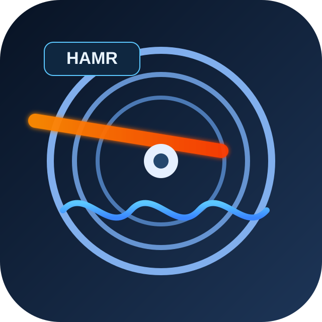

<p align="center">
  <a href="README.md" rel="noopener">
 </a>
</p>

<h3 align="center">HAMR-Simulator.py</h3>

<p align="center">
  中文 | <a href="README_EN.md">English</a>
</p>

<div align="center">


</div>

---

<p align="center"> 热辅助磁记录（HAMR）读写通道的Python仿真器，由C语言源码移植而来。
    <br> 
</p>

## 📝 目录

- [关于项目](#about)
- [架构](#architecture)
- [快速开始](#getting_started)
- [运行测试](#tests)
- [实验验证](#experiments)
- [项目结构](#structure)
- [Bug记录](#bugs)
- [致谢](#acknowledgement)

## 🧐 关于项目 <a name = "about"></a>

本项目是一个基于Python的热辅助磁记录（HAMR）仿真器，用于模拟磁记录读写通道的完整信号处理流程。代码最初来源于Prof. Bane Vasic实验室的C语言HAMR仿真器（约8,400行C代码），通过开源模型逐模块移植、修改、优化而来。

仿真器覆盖了从用户比特生成 → 编码 → 通道建模（纵向/垂直/HAMR）→ 低通滤波 → 均衡 → 检测（Viterbi/SOVA）→ 解码的完整流水线，支持三种游程受限码（RLL 4/5、MTR 6/7、TMTR 8/9）以及GPR目标自适应均衡。

磁存储器和光存储器对海量温冷数据存储意义重大，尽管技术已相当成熟，但长久以来缺乏较为完善的开源仿真系统，严重阻碍了研究人员参与研发更为先进的存储系统，且行业垄断严重，不利于各国人工智能硬件基础设施的部署和社会发展，故而将代码开源，以飨各位同仁。

## 🏗 架构 <a name = "architecture"></a>

### 信号处理流水线

```
UserBits → Encoder → Channel → LPF → Downsampler → Equalizer → Detector → Decoder
```

### 通道模型

| 类型              | 说明                                                                 |
| ----------------- | -------------------------------------------------------------------- |
| **Longitudinal**  | 纵向记录通道，基于FIR卷积 + Lorentzian脉冲响应                       |
| **Perpendicular** | 垂直记录通道，基于误差函数脉冲响应                                   |
| **HAMR**          | 热辅助磁记录通道，含热分布、微磁道累加、温度调制、NLTS等完整物理模型 |

### 编码方案

| 编码         | 码率 | 约束                             | 说明          |
| ------------ | ---- | -------------------------------- | ------------- |
| RLL(0,2)     | 4/5  | 任意两"1"间至少2个"0"            | 查表编解码    |
| MTR(2;8)     | 6/7  | 最多连续2个"1"，不超过8个连续"0" | 查表 + 替规则 |
| TMTR(2/3;11) | 8/9  | 交替位置约束                     | 查表编解码    |

### 检测器

| 检测器                            | 输入                  | 输出                          |
| --------------------------------- | --------------------- | ----------------------------- |
| **Classical Viterbi**             | 均衡后信号            | 硬判决比特                    |
| **Classical SOVA**                | 均衡后信号 + 噪声方差 | 硬判决 + 软输出（可靠性概率） |
| **Code-Constrained Viterbi/SOVA** | 同上 + 码约束回调     | 满足码约束的判决              |

## 🏁 快速开始 <a name = "getting_started"></a>

### 环境要求

- Python 3.9+
- NumPy
- SciPy（用于矩阵运算）
- Matplotlib（用于实验绘图）

### 安装

```bash
# 创建虚拟环境（推荐）
conda create -n hamr_sim python=3.9 numpy scipy matplotlib
conda activate hamr_sim

# 或使用 pip
pip install numpy scipy matplotlib
```

### 运行仿真

```bash
cd python_receiver

# 运行端到端仿真
python simulator.py

# 运行所有实验
python experiments/run_experiments.py

# 运行单个实验（如实验11：Viterbi vs SOVA对比）
python experiments/run_experiments.py --experiment 11
```

## 🔧 运行测试 <a name = "tests"></a>

项目包含 **241个测试用例**（9个测试文件，约3,600行），覆盖所有功能模块。

```bash
cd python_receiver

# 运行全部测试
pytest tests/ -v

# 带覆盖率报告
pytest tests/ --cov=. --cov-report=term-missing

# 运行特定测试文件
pytest tests/test_equalizer_detector.py -v

# 运行单个测试
pytest tests/test_equalizer_detector.py::TestViterbi::test_viterbi_basic -v
```

### 测试覆盖

| 模块                   | 覆盖范围                         |
| ---------------------- | -------------------------------- |
| 编码器（RLL/MTR/TMTR） | 所有码字查找表、替换规则         |
| 解码器                 | 所有码字反向查找、无效码字计数   |
| 通道模型               | 纵向/垂直/HAMR + 介质噪声        |
| LPF/FIR滤波器          | 不同滤波器长度、抽取率           |
| LMS均衡器              | 收敛性、GPR目标适应              |
| Viterbi检测器          | 不同PR目标、延迟、码约束         |
| SOVA检测器             | 软输出质量、概率传播             |
| 完整流水线集成         | 所有编码+通道+均衡+检测+解码组合 |

## 📊 实验验证 <a name = "experiments"></a>

项目内置 **14个实验**，用于验证各模块正确性并生成图表：

| 实验      | 说明                                              |
| --------- | ------------------------------------------------- |
| **Exp1**  | 通道脉冲响应（纵向/垂直/HAMR）                    |
| **Exp2**  | 低通滤波器频响                                    |
| **Exp3**  | FIR滤波器验证                                     |
| **Exp4**  | RLL(4/5)码分析（编码率、游程分布）                |
| **Exp5**  | Viterbi检测器BER vs SNR（清洁信道 + LMS均衡信道） |
| **Exp6**  | SOVA软输出分析                                    |
| **Exp7**  | LMS均衡器收敛性（多SNR）                          |
| **Exp8**  | GPR目标适应                                       |
| **Exp9**  | 编码开销分析                                      |
| **Exp10** | LCG随机数发生器分析                               |
| **Exp11** | Viterbi vs SOVA对比                               |
| **Exp12** | 完整流水线BER vs SNR（无编码/RLL/MTR/TMTR）       |
| **Exp13** | 所有编码方案回环BER对比                           |
| **Exp14** | 编解码恒等验证（零噪）                            |

实验图表保存在 `experiments/assets/` 目录。

## 📁 项目结构 <a name = "structure"></a>

```
python_receiver/
├── simulator.py                    # 主仿真驱动（~780行）
├── channel/
│   ├── channel.py                  # 通道模型（纵向/垂直/HAMR）
│   ├── hamr_channel.py             # HAMR全物理模型
│   ├── lpf.py                      # 低通滤波器
│   ├── fir.py                      # FIR滤波器
│   ├── media_noise.py              # 介质噪声（抖动/脉宽展宽）
│   └── math_utils.py               # LCG、高斯噪声、矩阵运算
├── encoders/
│   ├── rll_4_5.py                  # RLL(0,2) 4/5编码器
│   ├── mtr_6_7.py                  # MTR(2;8) 6/7编码器
│   ├── tmtr_8_9.py                 # TMTR(2/3;11) 8/9编码器
│   └── permutation.py              # Tribit最小化置换
├── decoders/
│   ├── rll_4_5.py                  # RLL 4/5解码器
│   ├── mtr_6_7.py                  # MTR 6/7解码器
│   └── tmtr_8_9.py                 # TMTR 8/9解码器
├── equalizer_detector/
│   ├── viterbi.py                  # Classical Viterbi检测器
│   ├── sova.py                     # SOVA软输出检测器
│   ├── equalizer.py                # LMS均衡器 + GPR目标适应
│   ├── constrained_detectors.py    # 码约束Viterbi/SOVA
│   └── detector.py                 # 公共API分发
├── experiments/
│   ├── run_experiments.py          # 14个实验的完整套件
│   ├── REPORT.md                   # 实验详细报告
│   └── assets/                     # 生成的图表
├── tests/
│   ├── test_channel.py             # 通道模型测试
│   ├── test_encoders.py            # 编码器测试
│   ├── test_decoders.py            # 解码器测试
│   ├── test_equalizer_detector.py  # 均衡器+检测器测试
│   ├── test_constrained_detectors.py
│   ├── test_integration.py         # 集成测试
│   ├── test_coverage_branches.py   # 分支覆盖率测试（241用例）
│   ├── test_permutation_and_math_utils.py
│   └── test_simulator_and_integration.py
└── data/                           # 码表文件（.dat）
```

## 🐛 已发现并修复的Bug <a name = "bugs"></a>

移植和验证过程中共发现并修复 **13个Bug**：

### 检测器（Detector）

| Bug             | 位置                 | 症状                                       | 根因                                                        |
| --------------- | -------------------- | ------------------------------------------ | ----------------------------------------------------------- |
| DC偏置缺失      | viterbi.py / sova.py | 非DC-free PR目标（如PR[1,2,1]）BER卡在0.37 | 分支度量少减了 `sum(pri)`                                   |
| SOVA buffer污染 | sova.py:93,104       | SOVA硬判决BER始终~0.36                     | `metric0 = path_metric[0, ...]`应为`path_metric[prev, ...]` |

### 通道模型（Channel）

| Bug             | 位置         | 症状             | 根因                             |
| --------------- | ------------ | ---------------- | -------------------------------- |
| 噪声范围错误    | simulator.py | 高频SNR下BER偏高 | 噪声只应加在内部区域而非全序列   |
| LPF输入截断     | simulator.py | 滤波输出尾部落差 | LPF输入应为`ch_output[:oss_len]` |
| HAMR简化通道bug | channel.py   | HAMR物理参数错误 | 简化通道未正确传递参数           |

### RNG/数值

| Bug          | 位置          | 症状             | 根因                                              |
| ------------ | ------------- | ---------------- | ------------------------------------------------- |
| LCG缓存冲突  | math_utils.py | 多通道噪声相关性 | `gaussian_random`在LCG上缓存违反`__slots__`       |
| 高斯噪声生成 | math_utils.py | 统计分布偏差     | Box-Muller缓存实现与C不匹配（CachedGaussian修正） |

### 实验/测试

| Bug            | 位置                      | 症状             | 根因                                      |
| -------------- | ------------------------- | ---------------- | ----------------------------------------- |
| GPR目标参数名  | test_coverage_branches.py | 测试崩溃         | `look_ahead`参数名不匹配                  |
| SOVA返回值解包 | test_coverage_branches.py | 返回值数量不匹配 | SOVA返回3个值但解包为2个                  |
| 编码长度引用   | test_coverage_branches.py | 切片越界         | 使用`encoded_len`而非`len(encoded)`       |
| 结果嵌套       | test_coverage_branches.py | 字典索引错误     | `results["results"]`应为`results`         |
| 假BER0崩溃     | run_experiments.py        | `semilogy`崩溃   | SNR点全零BER时绘图崩溃（设最小可检测BER） |
| 实验5过时文件  | assets/                   | 错误图表残留     | 删除过期`exp5_ber_snr_viterbi.png`        |

### 后续待修复/待澄清项

- C代码中`ClassicalViterbi_4By5RLLCode`与`ClassicalViterbi`完全相同（无需移植）
- C代码中`Viterbi()`/`SOVA()`基于ValidState的旧版本已被`ClassicalViterbi`/`ClassicalSOVA`取代
- C代码中温度调制tribit检测段被`&& 0`禁用，为死代码
- C代码中`ClassicalViterbiForTempMod`依赖不存在的`ValidSequencesOfLength9.dat`文件

## ⚙️ 与C代码的关系

| 指标     | C            | Python            |
| -------- | ------------ | ----------------- |
| 源文件   | 6个（.c/.h） | 26个模块          |
| 代码行数 | ~8,400行     | ~11,300行         |
| 测试     | 无           | 241个用例         |
| 实验验证 | 无           | 14个实验          |
| 功能覆盖 | 参考实现     | 100%覆盖C活跃功能 |

Python端实现了C代码中所有活跃功能模块（不包括死代码、复制品和已被取代的旧版本）。

## ✍️ 作者 <a name = "authors"></a>

- DeepSeek - Code review
- Qwen3.6-plus - Bug fixes
- Gemma4-31B-it - Initial code
- Qwen3.6-27B - Polishing, experiment design, and documentation

## 🎉 致谢 <a name = "acknowledgement"></a>

- 感谢Prof. Bane Vasic实验室前期的研究工作
- 感谢所有开源大模型对本项目的贡献

## 📝 许可证 <a name = "license"></a>

[Apache-2.0](LICENSE)
